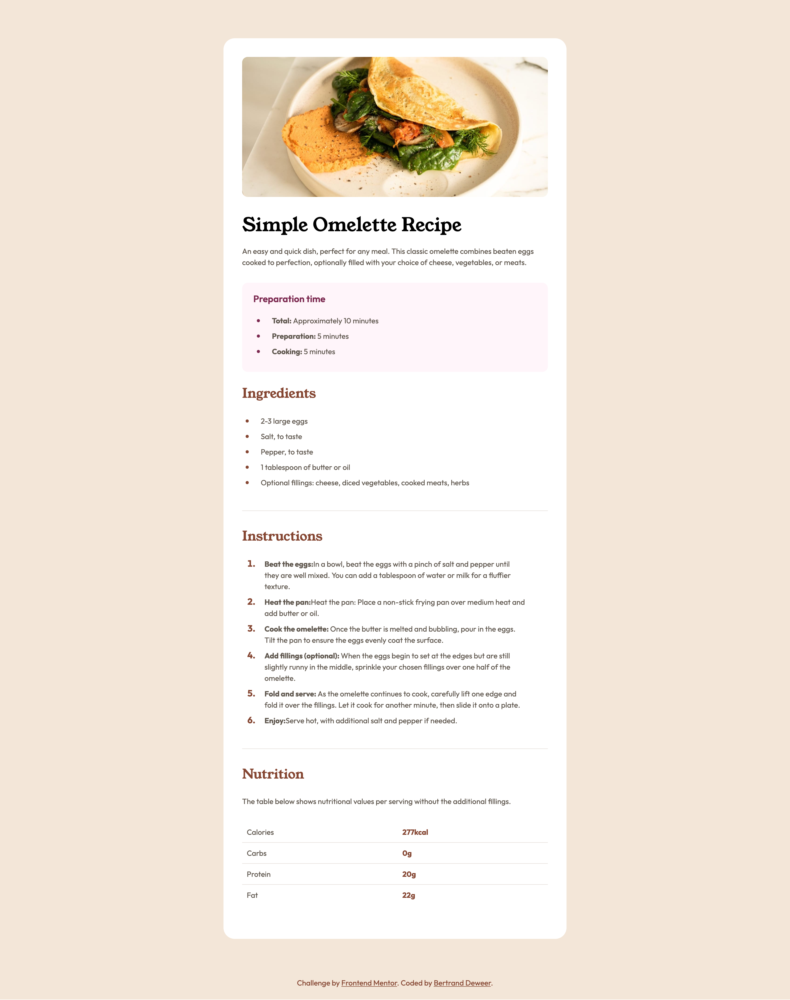

# Frontend Mentor - Recipe page solution

This is a solution to the [Recipe page challenge on Frontend Mentor](https://www.frontendmentor.io/challenges/recipe-page-KiTsR8QQKm). Frontend Mentor challenges help you improve your coding skills by building realistic projects. 

## Table of contents

- [Frontend Mentor - Recipe page solution](#frontend-mentor---recipe-page-solution)
  - [Table of contents](#table-of-contents)
  - [Overview](#overview)
    - [Screenshot](#screenshot)
    - [Links](#links)
  - [My process](#my-process)
    - [Built with](#built-with)
    - [What I learned](#what-i-learned)
    - [Continued development](#continued-development)
  - [Author](#author)


## Overview

### Screenshot



### Links

- Solution URL: [https://bdeweer.github.io/frontend-mentor-exercises/newbie/recipe-page/](https://bdeweer.github.io/frontend-mentor-exercises/newbie/recipe-page/)
- Live Site URL: [https://bdeweer.github.io/frontend-mentor-exercises/newbie/recipe-page/](https://bdeweer.github.io/frontend-mentor-exercises/newbie/recipe-page/)

## My process

### Built with

- Semantic HTML5 markup
- CSS custom properties
- Flexbox

**Note: These are just examples. Delete this note and replace the list above with your own choices**

### What I learned

J'ai appris à utiliser le positionnement flex. J'ai appris également qu'il est de mauvaise pratique de terminer le développement desktop avant de penser au rendu sur mobile. Il faut travailler de concert entre
J'ai appris également comment utiliser un front avec @import

```html
<ul class="preparation-list">
            <li>
              <span><strong class="text-preset-4 text-preset-4--bold">Total:</strong><span class="text-preset-4"> Approximately 10 minutes</span></span>
            </li>
            <li>
              <span><strong class="text-preset-4 text-preset-4--bold">Preparation:</strong><span class="text-preset-4"> 5 minutes</span></span>
            </li>
            <li>
              <span><strong class="text-preset-4 text-preset-4--bold">Cooking:</strong><span class="text-preset-4"> 5 minutes</span></span>
            </li>
          </ul>
```
```css
.picture {
  display: block; /* Evite l'espace sous l'image */
  max-width: 100%; /* L'image ne dépasse jamais son conteneur */
  height: auto; /* Conserve les propopertions */
  border-radius: 12px;
}
```

### Continued development

Je veux continuer à approfondir l'approche mobile first et le positionnement flex

## Author

- Website - [Bertrand Deweer](https://www.your-site.com)
- Frontend Mentor - [@bdeweer](https://www.frontendmentor.io/profile/bdeweer)
- Twitter - [@bdeweeronx](https://x.com/bdeweeronx)

